# Smokejumper 🪂🔥

**An agentic SRE that parachutes into your incidents.**

Smokejumpers are the elite firefighters who jump in the moment a wildfire alert lands, size it up, and contain it before it spreads. This project does the same for production incidents: an alert fires, Smokejumper drops in, dispatches specialist investigator agents in parallel, and reports back in Slack with a grounded conclusion and full receipts.

> **Status: design phase.** The v1 container architecture is done (below); implementation has not started. Watch/star if you want to follow along.

## Architecture (v1)



The editable Mermaid source is [`architecture/smokejumper-architecture.mmd`](architecture/smokejumper-architecture.mmd). Re-render with:

```bash
npx -y @mermaid-js/mermaid-cli -i architecture/smokejumper-architecture.mmd -o architecture/smokejumper-architecture.svg
```

### The blocks

| Block | Role | LLM? |
|---|---|---|
| **Receiver** | Normalize webhooks (Grafana, Datadog, PagerDuty, Slack, generic JSON) into `AgentEvent`s; fingerprint, dedupe, coalesce alert storms | No |
| **Intelligence** (LangGraph) | Supervisor orchestrator spins up specialist sub-agents from a declarative, versioned registry — DB Investigator, Metrics Analyst, Log Analyst, Code Investigator, Change Auditor, Precedent Researcher — each parallel, stateless, budgeted | Yes |
| **RAG / Knowledge** | `retrieve(ctx) → KnowledgeBundle` façade over four modalities: vector store (episodic memory), knowledge graph (`caused_by` / `fixed_by` / `applies_to` edges), recipe registry, federated MCP sources | — |
| **MCP Hub** | Governed tool gateway with a free **read tier** and an approval-gated **privileged tier** (destructive ops suspend the graph, require a human approval, and run on a single-use token) | No |
| **Actions** | Deterministic outputs — idempotent create-vs-update tickets, Slack receipts, findings write-back | No |
| **Governor + Scheduler** | Iteration/token budgets, circuit breakers, storm brake, scheduled investigations | No |
| **Flight Recorder** | Append-only audit spine: every event, node transition, LLM call, tool call, gate, and action — powers the replay/eval harness | No |
| **Distiller** | One-way learning loop from the Flight Recorder back into knowledge (case embeddings, graph edges, draft recipes), with a human gate on recipes | Yes |

### Design principles

- **Determinism at the edges.** No LLM in the Receiver or Actions — models only run inside the Intelligence block, behind budgets.
- **Everything is auditable.** Every block appends to the Flight Recorder; incidents are replayable.
- **Privileged ops need a human.** Destructive tool calls suspend the run and round-trip through a Slack approval before executing.
- **Hexagonal core.** Auth, governance, and tenancy are black-box ports (v1 ships `AllowAll` / `SingleTenant` / `EnvCredentials` stubs) so the core stays platform-independent.

## License

[MIT](LICENSE)
