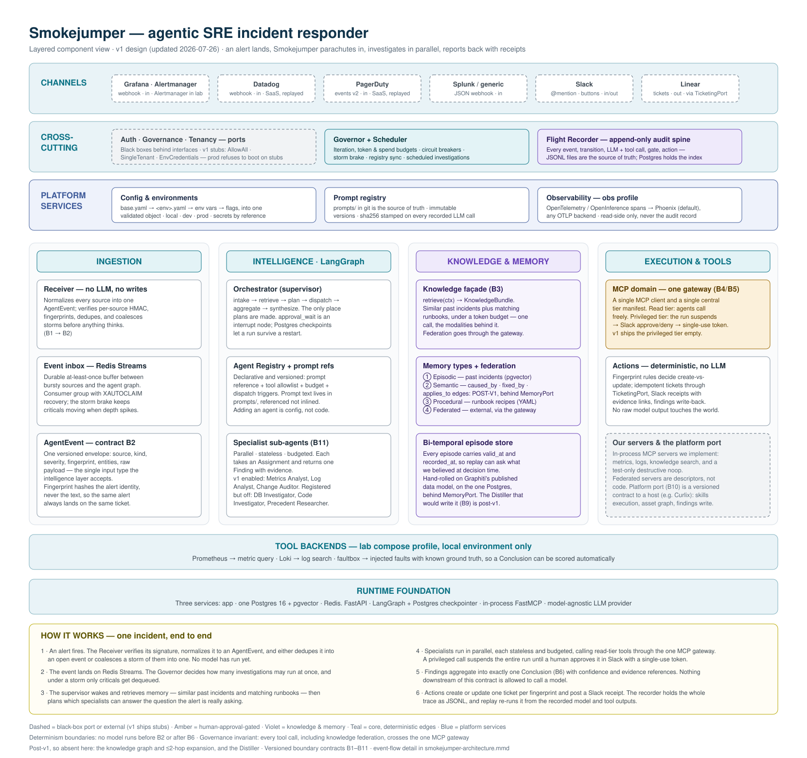

# Smokejumper 🪂🔥

**An agentic SRE that parachutes into your incidents.**

Smokejumpers are the elite firefighters who jump in the moment a wildfire alert lands, size it up, and contain it before it spreads. This project does the same for production incidents: an alert fires, Smokejumper drops in, dispatches specialist investigator agents in parallel, and reports back in Slack with a grounded conclusion and full receipts.

> **Status: design phase.** The v1 container architecture (below), the level-2 build spec ([SPEC.md](SPEC.md) — contracts, component behavior, flows, milestones), and the decision records ([docs/adr/](docs/adr/README.md) — every major choice with alternatives and trade-offs) are drafted; implementation has not started. Watch/star if you want to follow along.

## Architecture (v1)

### High-level components



### Event flow & boundary contracts



The component view (`smokejumper-components.svg`) is hand-maintained SVG — edit it directly, and keep it in sync when a block changes. The flow diagram's editable Mermaid source is [`architecture/smokejumper-architecture.mmd`](architecture/smokejumper-architecture.mmd). Re-render with:

```bash
npx -y @mermaid-js/mermaid-cli -i architecture/smokejumper-architecture.mmd -o architecture/smokejumper-architecture.svg
```

### The blocks

| Block | Role | LLM? |
|---|---|---|
| **Receiver** | Normalize webhooks (Grafana, Datadog, PagerDuty, Slack, generic JSON) into `AgentEvent`s; fingerprint, dedupe, coalesce alert storms | No |
| **Intelligence** (LangGraph) | Supervisor orchestrator spins up specialist sub-agents from a declarative, versioned registry — DB Investigator, Metrics Analyst, Log Analyst, Code Investigator, Change Auditor, Precedent Researcher — each parallel, stateless, budgeted | Yes |
| **RAG / Knowledge** | `retrieve(ctx) → KnowledgeBundle` façade over four modalities: vector store (episodic memory), knowledge graph (`caused_by` / `fixed_by` / `applies_to` edges), recipe registry, and federated sources reached through the MCP gateway | — |
| **MCP domain** | One gateway, one central tier manifest — a free **read tier** and an approval-gated **privileged tier** (destructive ops suspend the graph, require a human approval, and run on a single-use token). Every tool call crosses it, including knowledge federation | No |
| **Actions** | Deterministic outputs — idempotent create-vs-update tickets, Slack receipts, findings write-back | No |
| **Governor + Scheduler** | Iteration/token budgets, circuit breakers, storm brake, scheduled investigations | No |
| **Flight Recorder** | Append-only JSONL audit spine: every event, node transition, LLM call (stamped with prompt version + hash), tool call, gate, and action — powers the replay/eval harness | No |
| **Distiller** | One-way learning loop from the Flight Recorder back into knowledge (case embeddings, graph edges, draft recipes), with a human gate on recipes | Yes |

### Design principles

- **Determinism at the edges.** No LLM in the Receiver or Actions — models only run inside the Intelligence block, behind budgets.
- **Everything is auditable.** Every block appends to the Flight Recorder; incidents are replayable.
- **Privileged ops need a human.** Destructive tool calls suspend the run and round-trip through a Slack approval before executing.
- **One governance seam.** A single MCP gateway and a single tool→tier manifest, so no code path reaches an external tool without a tier check — and a tier change is always a one-file diff.
- **Hexagonal core.** Auth, governance, and tenancy are black-box ports (v1 ships `AllowAll` / `SingleTenant` / `EnvCredentials` stubs) so the core stays platform-independent.

## Running it locally

The default stack is three services — Postgres+pgvector, Redis, and the app:

```bash
docker compose up
```

A `lab` profile adds a real observability stack so alerts actually fire and specialist agents
have something to query: Prometheus + Alertmanager, Grafana, Loki + Promtail, and a `faultbox`
app you can tell to leak memory, return 500s, or stall. Because an injected fault has known
ground truth, this is also how eval cases get generated rather than hand-written.

```bash
docker compose --profile lab up          # local alert sources + metric/log backends
docker compose --profile fixtures up     # replays recorded Datadog/PagerDuty payloads
```

Datadog and PagerDuty are SaaS and have no local equivalent, so they're exercised by replaying
recorded webhook payloads at the Receiver — which is what the normalizers and signature
verification need tested anyway. See [SPEC §2c](SPEC.md) and
[ADR-0016](docs/adr/0016-local-observability-stack.md).

### Environments vs compose profiles

Two separate axes, deliberately not sharing the word "profile":

- **Compose profiles** (`lab`, `fixtures`) choose which *services* run.
- **Environments** (`SMOKEJUMPER_ENV=local|dev|prod`) choose which *values* the app uses —
  endpoints, model roles, spend ceilings, ticketing target, and whether stub ports are allowed.

Values layer `config/base.yaml` → `config/<env>.yaml` → `SMOKEJUMPER__*` env vars → CLI flags
into one validated settings object; secrets stay out of YAML entirely. `prod` refuses to boot
with stub ports or without an explicit spend ceiling. See [SPEC §2d](SPEC.md) and
[ADR-0018](docs/adr/0018-layered-environment-config.md).

### Traces and prompts

Instrumentation is OpenTelemetry (OpenInference conventions), emitted from inside the model port
and the MCP gateway — so the trace backend is a config value, not a dependency. The default is
Arize Phoenix, one container behind the `obs` profile; Langfuse works by repointing the exporter.

```bash
docker compose --profile obs up          # Phoenix: OTLP on 4317, UI on 6006
```

The JSONL flight recorder remains the audit source of truth — the trace platform is a read-side
consumer that can be wiped or swapped with no effect on replay. Note Phoenix is Elastic License
2.0, which is source-available rather than OSI open source; the OTel seam exists so that is a
swap rather than a trap.

Prompts are versioned artifacts in [`prompts/`](SPEC.md), not config strings. The agent registry
references `agents/<name>@vN`, versions are immutable, and every recorded LLM call carries the
prompt reference and its sha256 — so a regression is attributable to a prompt change and replay
can assert it is running the prompt it recorded. See
[ADR-0019](docs/adr/0019-observability-otel-phoenix.md) and
[ADR-0020](docs/adr/0020-prompt-registry-in-git.md).

## License

[MIT](LICENSE)
